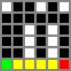

#  Maze Solver

一款基于 Jetpack Compose 的 GUI 字符迷宫求解器

// Todo 截图
---

> 由于在CTF Reverse中经常遇到迷宫题, 本人算法很烂不会写BFS, 于是一气之下写了个GUI自动化求解器
> 
> 刚好学了 Compose, 没想到 Android 也能搬到 Desktop 上, 于是就有了这个工具

## 🗺️原理
1. 输入`ASCII`和`CharMapping`字符映射关系
2. 转到`Solver.parseMaze()`分析返回
3. `Compose`可视化
4. `Solver.solveMaze()`求解返回
5. 整理输出
> 以上封装功能均可直接从源码调用
 
## ⬇️使用帮助

## 🥺捐赠
给孩子换个大一点的内存条吧, 开发时IDEA都急得爆内存不足了

//todo