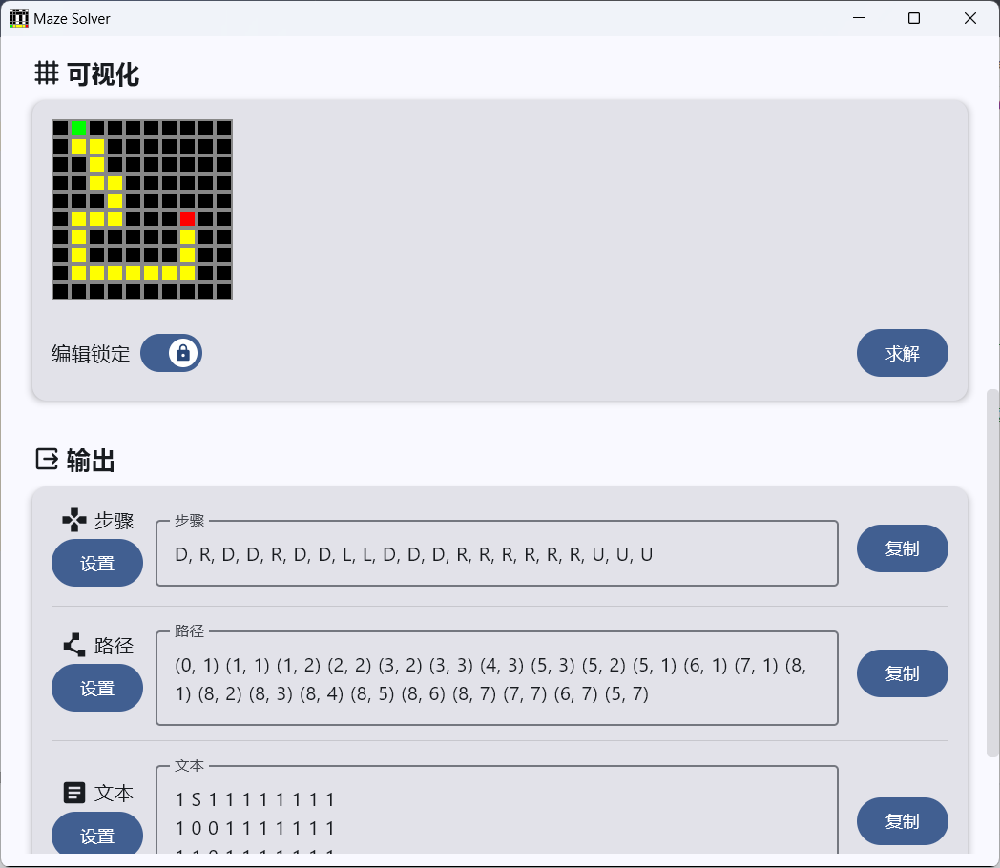

#  Maze Solver

一款基于 Compose for Desktop 的 GUI 字符迷宫求解器
  

---
> 主播由于在CTF Reverse/Misc中经常遇到迷宫题，~~本人算法很烂不会写BFS，~~ 于是一气之下写了个GUI自动化求解器
>
> 刚好学了 Compose，没想到 Android 也能搬到 Desktop 上，于是就有了这个工具
> 
> 工具截图加载不出来可见`Images`文件夹

---

## 🗺️原理
1. 输入`ASCII`和`CharMapping`字符映射关系
2. 转到`Solver.parseMaze()`分析返回
3. `Compose`可视化
4. `OutputParser.parse..()`求解返回
5. 整理输出
> 以上封装功能均可直接从源码调用

## ℹ️使用帮助
### 输入
首先将在**输入**中按照指示,填入字符串迷宫,例如:
>     '#', 'S', '#', '#', '#', '#', '#', '#', '#', '#',
>     '#', '*', '*', '#', '#', '#', '#', '#', '#', '#',
>     '#', '#', '*', '#', '#', '#', '#', '#', '#', '#',
>     '#', '#', '*', '*', '#', '#', '#', '#', '#', '#',
>     '#', '#', '#', '*', '#', '#', '#', '#', '#', '#',
>     '#', '*', '*', '*', '#', '#', '#', 'E', '#', '#',
>     '#', '*', '#', '#', '#', '#', '#', '*', '#', '#',
>     '#', '*', '#', '#', '#', '#', '#', '*', '#', '#',
>     '#', '*', '*', '*', '*', '*', '*', '*', '#', '#',
>     '#', '#', '#', '#', '#', '#', '#', '#', '#', '#'

- **Start** 为迷宫起始位置，**如 `S`**
- **End** 为迷宫结束位置，**如 `E`**
- **Wall** 为迷宫墙，**如 `#`**   必填
- **Empty** 为迷宫路，**如 `*`**  必填
- **Ignore** 用于忽略字符, 会过滤影响分析的字符 **如 `',`**

### 可视化
分析成功后会自动生成可视化网格，点击**编辑锁定**按钮即可解锁编辑

**解锁编辑**后可以编辑网格

- **左键**: 编辑`Wall`和`Empty`，分别为黑色和白色
- **右键**: 设置`Start`和`End`，分别为绿色和红色
- `Visited`: 求解后会生成路线，为黄色

### 输出
求解后会自动生成输出
- **步骤**: 路线的步骤，如`D, R, D, D, R, D, D, L, L, D, D, D...`
- **路径**: 路线的坐标，如`(0, 1) (1, 1) (1, 2) (2, 2) (3, 2)...`
- **文本**: 迷宫字符化，如`1 S 1 1 1 1 1 1 1 1\n1 0 0 1 1 1 1...`
- **代码**: 迷宫转代码，如`char grid[10][11] {"1S11111111", ...`

输出结果可以设置自定义字符，格式，语言等

## ⬇️下载
请到 [Github Release](https://github.com/LingerJAB/MazeSolver/releases) 下载

## 🥺捐赠
给孩子换个大一点的内存条吧, 开发时IDEA都急得爆内存不足了

